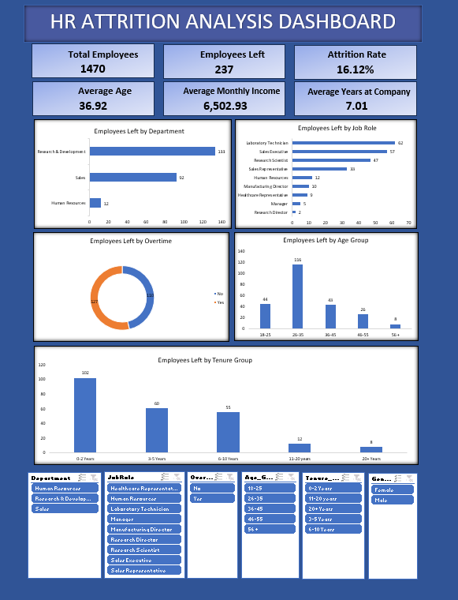
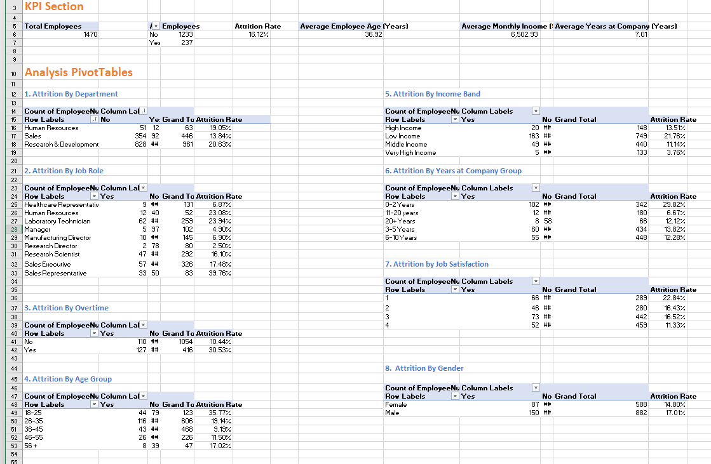
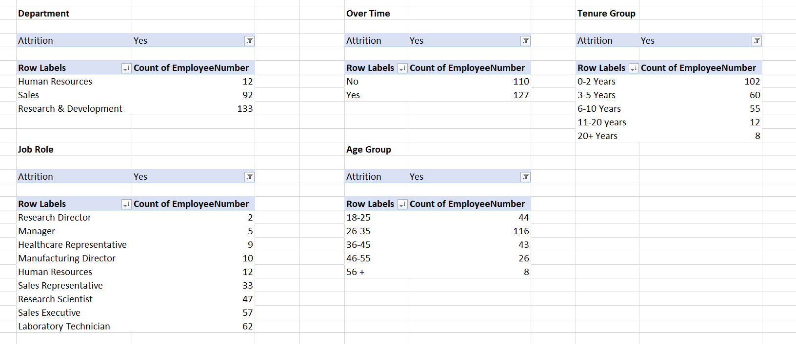

# HR Attrition Analysis Dashboard | Microsoft Excel

##  Project Overview

This project presents an end-to-end HR Attrition Analysis Dashboard developed in Microsoft Excel to analyze employee attrition and identify workforce trends. Using the IBM HR Analytics Employee Attrition & Performance dataset containing **1,470 employee records** and **35 workforce attributes**, the project covers data cleaning, data transformation, exploratory data analysis (EDA), KPI reporting, dashboard development, and business insights to support data-driven HR decision-making.

---

##  Business Problem

Employee attrition impacts workforce productivity, hiring costs, and employee retention. This project helps HR teams identify attrition patterns, monitor workforce KPIs, and support data-driven decisions through an interactive Excel dashboard.

---

##  Project Objectives

- Analyze employee attrition across multiple workforce dimensions.
- Perform data cleaning and transformation using Power Query.
- Develop KPIs for HR reporting.
- Build an interactive Excel dashboard.
- Generate business insights to support employee retention.

---

##  Tools Used

- Microsoft Excel
- Power Query
- Pivot Tables
- Pivot Charts
- Excel Formulas

---

##  Project Workflow

### 1. Business Understanding
- Defined the business problem, objectives, stakeholders, and KPIs.

### 2. Data Cleaning
- Verified data quality.
- Checked data types.
- Removed text inconsistencies using **TRIM** and **CLEAN**.

### 3. Data Transformation
Created business-ready fields:
- Age Group
- Income Band
- Tenure Group

### 4. Exploratory Data Analysis (EDA)
Analyzed employee attrition by:
- Department
- Job Role
- Overtime
- Age Group
- Income Band
- Tenure Group
- Job Satisfaction
- Gender

### 5. KPI Development
Developed:
- Total Employees
- Employees Left
- Attrition Rate
- Average Employee Age
- Average Monthly Income
- Average Years at Company

### 6. Dashboard Development
Built an interactive dashboard using:
- KPI Cards
- Pivot Tables
- Pivot Charts
- Slicers

---

##  Dashboard Features

- Department-wise Attrition Analysis
- Job Role Analysis
- Overtime Analysis
- Age Group Analysis
- Tenure Group Analysis
- Interactive KPI Cards
- Dynamic Slicers

---

##  Key Business Insights

- Sales department recorded the highest employee attrition.
- Employees working overtime showed significantly higher attrition.
- Employees with lower income experienced higher attrition.
- Early-tenure employees had the highest turnover.
- Higher job satisfaction was associated with lower attrition.

---

##  Skills Demonstrated

- Data Cleaning
- Data Transformation
- Power Query
- Exploratory Data Analysis (EDA)
- Pivot Tables
- KPI Reporting
- Dashboard Development
- Data Visualization
- Business Analysis

---

##  Dashboard Preview

### HR Attrition Dashboard

### Exploratory Data Analysis

### Pivot Table Analysis

---

##  Conclusion

This project demonstrates an end-to-end HR analytics solution using Microsoft Excel, transforming raw employee data into interactive dashboards and actionable business insights to support data-driven HR decision-making.
